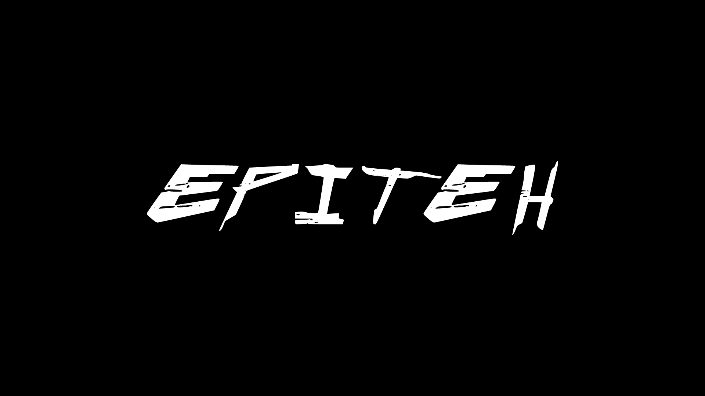

# ⚔️ Corewar

## 📖 About

The Corewar project is a game in which several programs called "Champions" will fight to stay the last one
alive. Corewar is actually a computer simulation in which processors will share memory to run on.
The project is based on a virtual machine in which the champions will fight for memory by all possible
means in order to win, the last champion being able to signal that he is alive wins the game. In other words,
the last champion to execute the "live" instruction is declared winner.

## 🛡️ Champion code example

```asm
        .name "Jon Snow"
        .comment "Winter is coming"

        sti r1, %: crow, %1
crow:   live %234
        ld %0, r3
        zjmp %:crow
```

## 🧭 Basic instruction

To help you understand the code above, here's a summary of how to use the instructions:

| Mnemonic/Opcode |                                                                       Effects                                                                          |
|:----------:| ------------------------------------------------------------------------------------------------------------------------------------------------------------ |
| 0x01 (live)|Takes 1 parameter: 4 bytes that represent the player’s number. It indicates that the player is alive.|
|0x02 (ld)|Takes 2 parameters. It loads the value of the first parameter into the second parameter, which must be a register (not the PC). `ld 34,r3` loads the `REG_SIZE` bytes starting at the address `PC + 34 % IDX_MOD` into `r3`.|
|0x03 (st)|Takes 2 parameters. It stores the first parameter’s value (which is a register) into the second (whether a register or a number). `st r4,34` stores the content of `r4` at the address `PC + 34 % IDX_MOD`. `st r3,r8` copies the content of `r3` into `r8`.|
|0x04 (add)|Takes 3 registers as parameters. It adds the content of the first two and puts the sum into the third one (which must be a register). `add r2,r3,r5` adds the content of `r2` and `r3` and puts the result into `r5`.|
|0x05 (sub)|Similar to `add`, but performing a subtraction.|
|0x06 (and)| takes 3 parameters. It performs a binary AND between the first two parameters and stores the result into the third one (which must be a register).`and r2, %0,r3 `puts `r2` & `0` into `r3`.|
|0x07 (or)|Similar to `and`, but performing a binary OR.|
|0x08 (xor)|Similar to `and`, but performing a binary XOR (exclusive OR).|
|0x09 (zjmp)|Takes 1 parameter, which must be an index. It jumps to this index if the carry is worth 1. Otherwise, it does nothing but consumes the same time. `zjmp %23 puts`, if carry equals 1, `PC + 23 % IDX_MOD` into the PC.|
|0x0A (ldi)|Takes 3 parameters. The first two must be indexes or registers, the third one must be a register.`ldi 3,%4,r1` reads IND_SIZ bytes from the address `PC + 3 % IDX_MOD`, adds 4 to this value. The `sum` is named S. `REG_SIZE` bytes are read from the address `PC + S % IDX_MOD` and copied into `r1`.|
|0x0B (sti)|takes 3 parameters. The first one must be a register. The other two can be indexes or registers. `sti r2,%4,%5` copies the content of `r2` into the address `PC + (4+5)% IDX_MOD`.|
|0x0C (fork)| takes 1 parameter, which must be an index. It creates a new program that inherits different states from the parent. This program is executed at the address `PC + first parameter % IDX_MOD`.|
|0x0D (lld)|Similar to `ld` without the `% IDX_MOD`.|
|0x0E (lldi)|Similar to `ldi` without the `% IDX_MOD`.|
|0x0F (lfork)|Similar to `fork` without the `% IDX_MOD`.|
|0x10 (aff)|takes 1 parameter, which must be a register. It displays on the standard output the character whose ASCII code is the content of the register (in base 10). A 256 modulo is applied to this ASCII code. `aff r3` displays ’*’ if `r3` contains `42`.|

## 🔨 THE ASSEMBLER
```
USAGE
    ./asm file_name[.s]
DESCRIPTION
    file_name file in assembly language to be converted into file_name.cor, an
    executable in the Virtual Machine.
```
Now that you know what a champion is made of, you will have to transcribe them into a language that the
virtual machine can understand, i.e. into machine code.
To do this, you will have to translate line after line (instruction after instruction).

## 🩸 THE VIRTUAL MACHINE
```
USAGE
    ./corewar [-dump nbr_cycle] [[-n prog_number] [-a load_address] prog_name]...
DESCRIPTION
    -dump nbr_cycle, dumps the memory after the nbr_cycle execution (if the round isn’t
    already over) with the following format: 32 bytes/line
    in hexadecimal (A0BCDEFE1DD3...)
    -n prog_number, sets the next program’s number. By default, the first free number
    in the parameter order
    -a load_address, sets the next program’s loading address. When no address is
    specified, optimize the addresses so that the processes are as far
    away from each other as possible. The addresses are MEM_SIZE modulo.
```
The machine’s role is to execute the programs that are given to it as parameters, generating processes.
It must check that each champion calls the "live" instruction every `CYCLE_TO_DIE` cycles.
If, after `NBR_LIVE` executions of the instruction "live", several processes are still alive, `CYCLE_TO_DIE` is decreased by `CYCLE_DELTA` units. This starts over until there are no live processes left.
The last champion to have said "live" wins.

## 🔥 Usage examples

- In your shell, just execute : ```make```
- Use **THE ASSEMBLER** :
    - Run ./asm/asm with your ```.s``` file (champion file).
    - Example : ```./asm/asm xerion.s```

- Use **THE VIRTUAL MACHINE** :
    - run ```./corewar/corewar``` with two ```.cor``` file (Champion file (.s) compiled with assembler).
    - Example : ```./corewar/corewar xerion.cor xena.cor```

## 📕 License

Distributed under the [MIT](https://choosealicense.com/licenses/mit/) License. Look at the `LICENSE` file for more information.